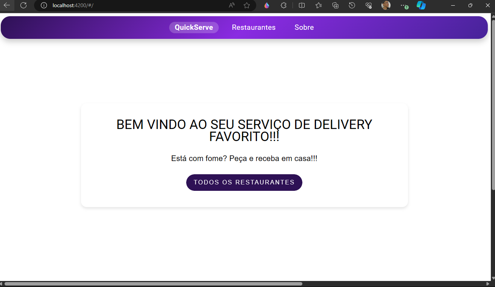
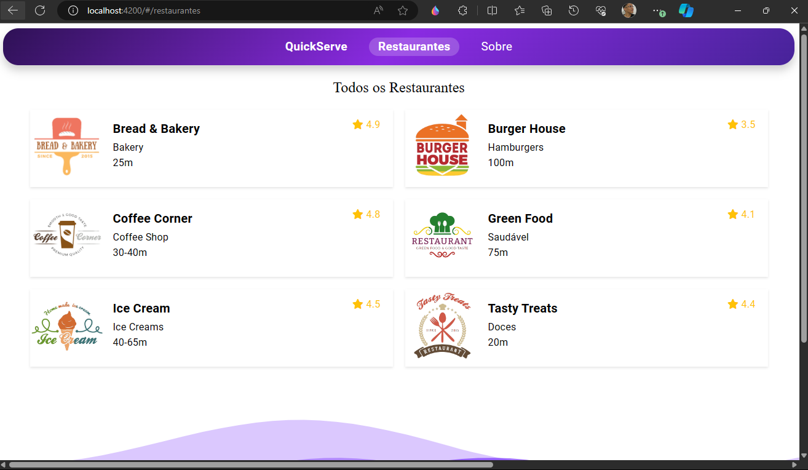

<!-- PROJECT_METADATA
{
  "title": "QuickServe — Delivery Site",
  "short_description": "Frontend Angular para plataforma de delivery: listagem de estabelecimentos, cardápio interativo e fluxo de pedido com JSON Server como mock de API.",
  "primary_stack": ["Angular", "TypeScript", "SCSS", "JSON Server"],
  "architecture": "Full-Stack Web",
  "detail_description": "Aplicação web de delivery desenvolvida com Angular 17 e TypeScript. Implementa listagem de empresas de venda, cardápio dinâmico e fluxo completo de pedido. Utiliza JSON Server para simular uma API REST durante o desenvolvimento, com serviços Angular para abstração da camada HTTP. Design responsivo com SCSS e componentes reutilizáveis."
}
-->

# QuickServe — Delivery Site

Frontend Angular para plataforma de delivery, com listagem de estabelecimentos, cardápio interativo e fluxo de pedido.

## Funcionalidades

- Listagem de empresas e estabelecimentos
- Visualização de cardápio por estabelecimento
- Fluxo de pedido completo
- Interface responsiva (com limitações em telas menores)
- Integração com API REST simulada via JSON Server

## Stack Técnica

| Camada | Tecnologia |
|---|---|
| Framework | Angular 17 (Angular CLI 17.3.3) |
| Linguagem | TypeScript |
| Estilos | SCSS |
| Mock API | JSON Server |
| Runtime | Node.js |

## Como Rodar

### Pré-requisitos
- Node.js e npm
- Angular CLI: `npm install -g @angular/cli`

```bash
# Instalar dependências
npm install --force

# Iniciar JSON Server (mock API)
npx json-server db.json

# Em outro terminal: iniciar servidor de desenvolvimento
npm start
# ou: ng serve
```

Acesse `http://localhost:4200/`

> **Importante:** O JSON Server precisa estar rodando para todas as funcionalidades funcionarem corretamente.

## Screenshots


| Tela 1 | Tela 2 |
|---|---|
|  |  |
